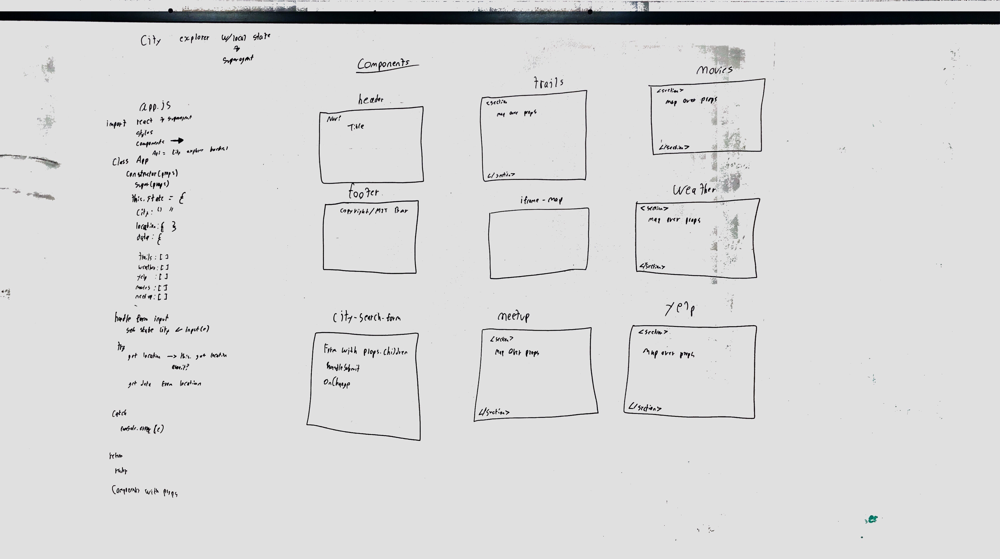
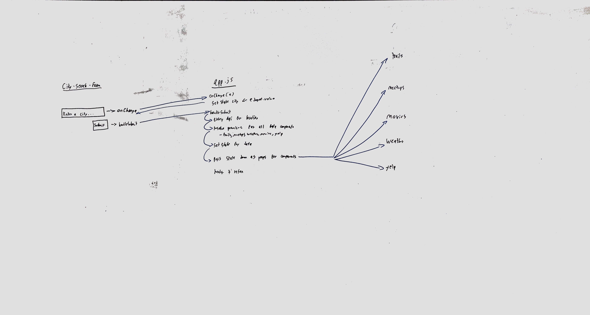

 PROJECT
=================================================

<!-- LINKS -->
<!-- Code Sandbox -->
[1]: https://codesandbox.io/s/cityexplorerfinal-vkje5
<!-- Front End -->
[2]: h
<!-- Back End -->
[3]: https://city-explorer-backend.herokuapp.com/
<!-- https://obscure-bayou-17929.herokuapp.com/ -->


## City Explorer

### Author: Alexander White

### Links and Resources
* [Code Sandbox][1]
* [Deployed Front End app (Netlify)(Coming soon)][2]
* [Provided Back End][3]

### Modules
```
src/
├── app.js
├── components/
│   ├── city-search-form/
│   │   ├── index.js
│   ├── footer/
│   │   ├── index.js
│   ├── header/
│   │   ├── index.js
│   ├── iframe-map/
│   │   ├── index.js
│   ├── meetups/
│   │   ├── index.js
│   ├── movies/
│   │   ├── index.js
│   ├── trails/
│   │   ├── index.js
│   ├── weather/
│   │   ├── index.js
│   ├── yelp/
│   │   ├── index.js
├── helper-fetcher.js
└── index.js
```
#### `index.js`
Entry point for the React application. 
Imports `App` component and adds it to function component `Main`.
Renders the `Main` component into the `#root` `<div>`.

#### `app.js`
`App` manages the state of the application as well as all helper and fetcher functions. It also passes down `props.children` to the components and renders all of them. It also impports all the styling.

#### `helper-fetcher.js`
I wanted to migrate all the helper functions over to this but ran out of time.


### Setup
* `npm i`
  - installs app dependencies
* `API_URL`
  - URL to the running back-end City Explorer server


#### Running the app
* Clone down the repo
* `npm run start`
  - runs the app in development mode; navigate to http://localhost:3000 to view it in the browser
  

### Step Through Process
I started this project with a UML breaking apart all the services into components as well as the `Header`, `Footer`, `CitySearchForm` and `Map` into components. `App` was going to hanlde all my state so I planned on passing all the data down to the components as `props.children`. Initially I set state up to accept `city`, `location`, and all the services preset in `data` but I had issues creating the Promise Array so instead I set them as a const globally and mapped over them then `setState` with the returned data.



Next I traced the path a user would follow to ensure I had all my bases covered. They would first type into the `input` element which would trigger the `onChange` calling the `handleCitySearchFormChange` function which sets state with their input. On submit, the `citySearcher` function is called and using async and promise, the location and all the relevent service data is collected and set in state. then it gets passed down to the components through `props.children`.
